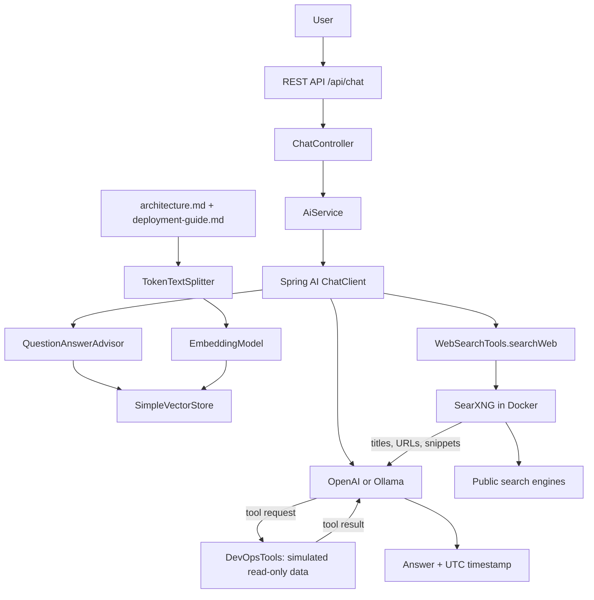

# Spring AI — Build Your First AI App

A NextGenTechForge tutorial: **Java 21 → Spring Boot → Spring AI → LLM → Tool Calling → RAG**.

## What we are building

A small REST engineering assistant that answers general questions, retrieves fictional platform documentation, calls safe Java tools for simulated operational observations, and searches the public web with a local SearXNG service. Designed for a 20–30 minute video: API (5 min), ChatClient and providers (5 min), tools (5 min), RAG (10 min), tests and production discussion (5 min).

The application uses real Spring AI provider adapters. It does not include a pretend LLM runtime. Automated tests replace the external provider with mocks or an HTTP stub; live use needs OpenAI access or local Ollama models.

## Architecture



The advisor runs retrieval for every question; this simple demo has no intent router. The model is instructed to use relevant documents for platform questions, tools for current observations, and general knowledge for general questions. Tools are registered with ChatClient; the model selects them, not keyword-based application code. Each request is stateless.

## Technology stack

| Component | Version / choice |
| --- | --- |
| Java | 21 toolchain |
| Gradle wrapper | 8.14.3 |
| Spring Boot | 4.1.1 |
| Spring AI | 2.0.1 stable BOM |
| HTTP | Spring MVC, Bean Validation, Problem Details |
| AI | ChatClient, OpenAI/Ollama starters, @Tool |
| Retrieval | QuestionAnswerAdvisor, TokenTextSplitter, SimpleVectorStore |
| Testing | JUnit, Mockito, MockMvc, embedded HTTP provider stub |

Spring AI 2.x supports Spring Boot 4.0/4.1: [official getting started](https://docs.spring.io/spring-ai/reference/getting-started.html). Advisor configuration: [Spring AI RAG reference](https://docs.spring.io/spring-ai/reference/api/retrieval-augmented-generation.html).

## Prerequisites

- JDK 21, with `JAVA_HOME` pointing to it. Check `./gradlew --version` (Windows: `.\gradlew.bat --version`).
- Internet for the first Gradle dependency download.
- OpenAI API access with available quota **or** Docker Compose and enough RAM/disk for Ollama. An 8B model can require several GB and is slow on CPU.
- Bash curl or PowerShell 7 for examples. No globally installed Gradle is required.

## Project structure

```text
nextgentechforge-spring-ai/
├── src/main/java/com/nextgentechforge/springai/
│   ├── SpringAiApplication.java
│   ├── config/{AiConfig,WebSearchConfig}.java
│   ├── controller/{ChatController,ApiExceptionHandler,WebSearchController}.java
│   ├── dto/{ChatRequest,ChatResponse,WebSearchResponse}.java
│   ├── service/{AiService,AiUnavailableException,WebSearchService}.java
│   └── tools/{DevOpsTools,WebSearchTools}.java
├── src/main/resources/
│   ├── application.yml
│   └── docs/{architecture,deployment-guide}.md
├── src/test/java/com/nextgentechforge/springai/
│   ├── controller/ChatControllerTest.java
│   ├── service/{AiServiceTest,WebSearchServiceTest}.java
│   ├── tools/DevOpsToolsTest.java
│   └── integration/{ApplicationIntegrationTest,OllamaProfileIntegrationTest}.java
├── .github/workflows/build.yml
├── .gitattributes
├── .env.example
├── .gitignore
├── config/searxng/{settings.yml,start.sh}
├── postman/NextGenTechForge.postman_collection.json
├── docker-compose.yml
├── build.gradle
├── settings.gradle
├── gradlew
├── gradlew.bat
├── gradle/wrapper/{gradle-wrapper.jar,gradle-wrapper.properties}
├── VERIFICATION.md
└── README.md
```

## Running with OpenAI

Run commands from the repository root. The default profile is `openai`. Supply credentials through your process environment or secret manager. Do not paste a real key into files, source control, screenshots, or shell history.

Bash (interactive secret prompt):

```bash
read -rsp 'OpenAI API key: ' OPENAI_API_KEY; echo
export OPENAI_API_KEY
export SPRING_PROFILES_ACTIVE=openai
export OPENAI_MODEL=gpt-4o-mini
export OPENAI_EMBEDDING_MODEL=text-embedding-3-small
./gradlew bootRun
```

PowerShell 7:

```powershell
$secret = Read-Host 'OpenAI API key' -AsSecureString
$env:OPENAI_API_KEY = [System.Net.NetworkCredential]::new('', $secret).Password
$env:SPRING_PROFILES_ACTIVE = 'openai'
$env:OPENAI_MODEL = 'gpt-4o-mini'
$env:OPENAI_EMBEDDING_MODEL = 'text-embedding-3-small'
.\gradlew.bat bootRun
```

Startup reads and embeds the Markdown documents, which makes paid embedding calls with OpenAI. Each chat also embeds its query. Wait for the `Started SpringAiApplication` log. Indexing errors fail startup rather than silently disabling RAG. After shutdown clear the key with `unset OPENAI_API_KEY` or `Remove-Item Env:OPENAI_API_KEY`.

Build an executable jar with `./gradlew build`; run it using JDK 21: `java -jar build/libs/nextgentechforge-spring-ai-1.0.0.jar` with the same environment variables.

## Running with Ollama

No OpenAI key is needed. The app runs on the host; Compose runs Ollama and SearXNG.

```bash
# 1. Start Ollama (CPU works; optional GPU setup is machine-specific).
docker compose up -d
# 2. Download a chat model with tool support.
docker compose exec ollama ollama pull llama3.1:8b
# 3. Download a separate embedding model.
docker compose exec ollama ollama pull nomic-embed-text
# 4. Start the application.
export SPRING_PROFILES_ACTIVE=ollama
export OLLAMA_BASE_URL=http://localhost:11434
export OLLAMA_CHAT_MODEL=llama3.1:8b
export OLLAMA_EMBEDDING_MODEL=nomic-embed-text
./gradlew bootRun
# 5. In another terminal, send the curl examples below.
```

If a per-user Docker Desktop installation is not on PowerShell's PATH, make its CLI and credential helper available in the current terminal before running Docker commands:

```powershell
$dockerBin = Join-Path $env:LOCALAPPDATA 'Programs\DockerDesktop\resources\bin'
$env:Path = "$dockerBin;$env:Path"
docker version
```

PowerShell: the three Docker commands above are unchanged; then:

```powershell
$env:SPRING_PROFILES_ACTIVE = 'ollama'
$env:OLLAMA_BASE_URL = 'http://localhost:11434'
$env:OLLAMA_CHAT_MODEL = 'llama3.1:8b'
$env:OLLAMA_EMBEDDING_MODEL = 'nomic-embed-text'
.\gradlew.bat bootRun
```

Choose exactly one provider profile. Compose persists downloaded models in `ollama-data`. Stop with `docker compose down`; do not add `-v` unless you intend to delete downloaded models. Model names are configurable; pull the exact names you configure. The pinned Compose image is a reproducible tutorial baseline, not a security-update policy.

`.env.example` documents environment variables. Spring Boot and Gradle **do not automatically read `.env`**. Export variables as shown. Docker Compose reads `.env` for its own substitutions only.

## Testing the application

```bash
./gradlew clean test
./gradlew build
./gradlew clean build
```

On Windows replace `./gradlew` with `.\gradlew.bat`. Tests require no credentials, Docker or paid calls. The integration test starts the full Spring application on a random port and a local OpenAI-compatible HTTP stub. It exercises provider serialization, startup document indexing, RAG context propagation, REST responses, and a model-requested Java tool round trip. A second integration test boots the Ollama profile without OpenAI credentials and exercises its HTTP adapters. The tests use fixed embeddings and scripted answers to verify wiring, **not semantic retrieval quality or live model decisions**. Unit tests cover blank/missing/oversized/malformed requests, timestamps, provider failure, simulated tools, and tool annotation discovery.

Read the HTML report at `build/reports/tests/test/index.html`. CI runs `clean build` on Java 21. See `VERIFICATION.md` for the actual local run results and remaining live checks.

## Basic chat example

Ask: `Explain dependency injection in one paragraph.` The answer uses general model knowledge. Response shape:

```json
{"answer":"...","timestamp":"2026-09-19T12:00:00Z"}
```

## Tool calling example

Ask: `What version of payment-service is currently running?` Expected fact: **2.4.1**, explicitly labeled simulated. Other fixtures: order-service **1.8.3 / RUNNING**, notification-service **3.1.0 / DEGRADED**. Unknown services and environments return UNKNOWN instead of fabricated observations. Only production has environment observations.

## RAG example

Ask: `How does our payment-service communicate with order-service?` Expected facts: **Kafka/MSK**, `orders.created.v1`, payment events on `payments.events.v1`, and asynchronous communication. Ask about rollback to retrieve the deployment guide. Platform-specific facts absent from the documents should produce an admission of missing information.

## curl commands

Bash/macOS/Linux — five copyable demonstrations:

```bash
curl --fail-with-body http://localhost:8080/api/health
curl --fail-with-body http://localhost:8080/api/chat -H 'Content-Type: application/json' -d '{"message":"Explain dependency injection in one paragraph."}'
curl --fail-with-body http://localhost:8080/api/chat -H 'Content-Type: application/json' -d '{"message":"What version of payment-service is currently running?"}'
curl --fail-with-body http://localhost:8080/api/chat -H 'Content-Type: application/json' -d '{"message":"How does our payment-service communicate with order-service?"}'
curl --fail-with-body http://localhost:8080/api/chat -H 'Content-Type: application/json' -d '{"message":"How do we roll back a failed deployment?"}'
```

PowerShell equivalents avoid native curl quoting differences:

```powershell
Invoke-RestMethod http://localhost:8080/api/health
$questions = @(
  'Explain dependency injection in one paragraph.',
  'What version of payment-service is currently running?',
  'How does our payment-service communicate with order-service?',
  'How do we roll back a failed deployment?'
)
foreach ($question in $questions) {
  Invoke-RestMethod http://localhost:8080/api/chat -Method Post -ContentType 'application/json' -Body (@{message=$question} | ConvertTo-Json)
}
```

`message` must be nonblank and at most 4,000 characters. Invalid requests return HTTP 400; upstream AI failures return a generic HTTP 503 Problem Detail without provider secrets. `/api/health` is local application health, not an AI-provider connectivity probe. Actuator provides `/actuator/health`, `/actuator/health/liveness`, and `/actuator/health/readiness`.

## How RAG works

1. `AiConfig` reads packaged `docs/*.md`, retaining source filename metadata.
2. `TokenTextSplitter` creates roughly 350-token chunks.
3. The selected provider embeds the chunks; `SimpleVectorStore` stores vectors in memory.
4. For each question, the advisor embeds the query and retrieves up to `RAG_TOP_K` chunks (default 4), above `RAG_SIMILARITY_THRESHOLD` (default 0.25).
5. A custom prompt adds reference material while allowing normal chat and tool use. Platform answers are instructed to stay grounded in the documents.

The index is rebuilt on each startup. Tune similarity thresholds for the chosen embedding model using representative questions; scores are not portable across models. Retrieved source metadata remains in the vector store, but this small API exposes only answer and timestamp; model-generated title citations are not a verified citation API. Grounding instructions reduce invention but cannot guarantee truthfulness.

## How tool calling works

`ChatClient.defaultTools` exposes three `@Tool` schemas. The LLM requests a named function with JSON arguments; Spring AI validates/deserializes the arguments, calls the Java method, sends its result back to the model, and returns the resulting answer. The integration test verifies this round trip. DevOps tools never execute commands, change infrastructure, perform network operations or access credentials. The separate web-search tool makes read-only requests to the configured SearXNG service.

## Production considerations

The code uses constructor injection, immutable DTOs, validation, provider isolation, safe HTTP errors and repeatable tests. It remains an educational local application, not a publicly deployable service without additional work:

- Bind defaults to loopback. Add authentication/authorization, TLS, rate limits, request-body limits, concurrency limits and usage budgets before public exposure.
- Prefer a persistent VectorStore such as **PGvector, Qdrant or Redis**. SimpleVectorStore rebuilds and re-embeds on restart and is unsuitable for large distributed indexes.
- Add asynchronous versioned ingestion, document ACL filtering, evaluated retrieval thresholds and explicit source citations. Review prompt injection and tool permissions independently of model instructions.
- Add request deadlines and cancellation, bounded tool iterations, circuit breakers and provider telemetry without logging prompts, keys or sensitive tool data. HTTP timeouts are not an end-to-end execution deadline.
- Keep dependencies and container images patched; scan releases. Use a secret manager, deployment readiness checks and audited operational tooling.
- Embeddings and prompts are sent to the selected provider. Only fictional public docs are bundled here. Evaluate privacy before adding real internal documents.
- This application does not deploy AWS resources; AWS names and rollback procedures are teaching material.

## Troubleshooting

| Symptom | Fix |
| --- | --- |
| Wrong Java / toolchain missing | Set JAVA_HOME to JDK 21; restart terminal; inspect wrapper version output. |
| Missing API key / startup fails | Set OPENAI_API_KEY in the same shell, or select ollama profile. |
| 401 / quota / model denied | Check provider account, available models and quota; no real key belongs in this repository. |
| Ollama connection refused | Start Compose, inspect `docker compose logs ollama`, and verify port 11434. |
| Model not found | Pull both exact chat and embedding model names. |
| Slow CPU generation / timeout | Use a smaller tool-capable model or appropriate GPU setup; adjust OPENAI_TIMEOUT for OpenAI or AI_READ_TIMEOUT for Ollama if needed. |
| RAG gives no useful answer | Confirm Markdown facts, check embedding model and tune RAG_SIMILARITY_THRESHOLD; rebuild/restart after editing docs. |
| No tool call | Use a model supporting tools and a direct version/status question; model behavior is probabilistic. |
| Port 8080 occupied | Set SERVER_PORT and update example URLs. |
| Network download failure | Check Maven Central/Gradle access and corporate certificate configuration. |

Live acceptance: after starting either real provider, run all five commands, also ask `Where is the payment service deployed?` (ECS Fargate, us-east-1, forge-production) and `What is notification-service status?` (simulated DEGRADED). Inspect grounding and tool results rather than expecting byte-identical generated prose.

## Postman examples

Import `postman/NextGenTechForge.postman_collection.json` into Postman. The collection defines `baseUrl=http://localhost:8080` and includes health, general chat, tool calling, RAG, direct internet search, and web-grounded chat requests. No API authentication is required for this local tutorial. The Ollama HTTP read timeout defaults to 90 seconds and can be configured with `AI_READ_TIMEOUT`; `AI_CONNECT_TIMEOUT` defaults to 10 seconds. A slow provider returns HTTP 503. These are per-provider-request limits, not a total multi-tool execution deadline.

## Internet access for the local LLM

The model uses a Java `searchWeb(query)` tool. The application queries **SearXNG**, a search service running beside Ollama in Docker, then returns up to three titles, source URLs and bounded snippets to the model. The model is instructed to cite those URLs. Ollama inference stays local; search queries are sent to public search engines. No paid search API key is required.

```text
/api/chat → local model → searchWeb → SearXNG → public search engines
                        ← titles + URLs + snippets ←
          ← answer with source links
```

Start or update both services:

```bash
docker compose up -d
```

Then run the application with the Ollama profile as above. SearXNG listens on `http://localhost:8888`; it is bound to loopback. The model can choose the tool automatically when prompted explicitly:

```bash
curl --fail-with-body http://localhost:8080/api/chat -H 'Content-Type: application/json' \
  -d '{"message":"Search the internet for the latest Spring Boot release information. Cite the source URLs."}'
```

PowerShell / Postman JSON body:

```json
{"message":"Search the internet for the latest Spring Boot release information. Cite the source URLs."}
```

For a quick check independent of LLM inference, use the same search service directly through the application:

```bash
curl --get --fail-with-body http://localhost:8080/api/web/search --data-urlencode 'q=Spring Boot official releases'
```

```powershell
Invoke-RestMethod 'http://localhost:8080/api/web/search?q=Spring%20Boot%20official%20releases'
```

In Postman: `GET {{baseUrl}}/api/web/search`, with query parameter `q=Spring Boot official releases`. This endpoint returns `query`, `status`, `note`, `fetchedAt`, and `sources` containing `title`, `url`, `snippet`. It performs live search without asking the LLM to summarize. Missing/invalid queries return 400; disabled or unavailable search returns 503; no matches return 200 with `NO_RESULTS` and an empty list. The chat tool receives these same structured statuses so it can explain a failed lookup.

| Variable | Default | Purpose |
| --- | --- | --- |
| `WEB_SEARCH_ENABLED` | `true` | Set to `false` to prevent search requests. |
| `SEARXNG_BASE_URL` | `http://localhost:8888` | Address of the search service, configured by the operator. |
| `WEB_SEARCH_TIMEOUT` | `10s` | Search HTTP timeout; positive and at most 60 seconds. |
| `WEB_SEARCH_MAX_RESULTS` | `3` | Maximum sources, from 1 to 5. |

Search adds no startup dependency: ordinary chat, RAG and DevOps tools can still initialize when SearXNG is offline. Query length is limited to 300 characters, snippets to 600 characters and titles to 200 characters. The Java tool never downloads arbitrary result URLs. It calls only the configured SearXNG address; result links are filtered to HTTP(S), deduplicated, and returned as citations. The configured search service should be trusted and kept local.

SearXNG's container image is pinned to a digest. Its small startup script generates a signing secret in the container at runtime, so there is no secret to copy into Git. The service does not need a public reverse proxy or a cache server for this private demo. See [SearXNG's Search API](https://docs.searxng.org/dev/search_api.html) and [container documentation](https://docs.searxng.org/admin/installation-docker.html).

Search-engine CAPTCHAs, rate limits, outdated snippets and temporary outages can affect results. Some engines may fail while others still return usable sources. A retrieval timestamp is not a publication date, and snippets are not full-page evidence. The model is instructed to distinguish public search results from simulated DevOps observations, treat snippets as untrusted data, and never invent citations. These instructions do not guarantee factual correctness or prevent every prompt-injection attempt. Do not put credentials or private document contents into public search queries.

If internet answers are slow, first try `/api/web/search` to distinguish search availability from local inference latency. A successful search endpoint does not establish that the local model completed the subsequent tool-calling conversation. Current local-model limitations are recorded in `VERIFICATION.md`.